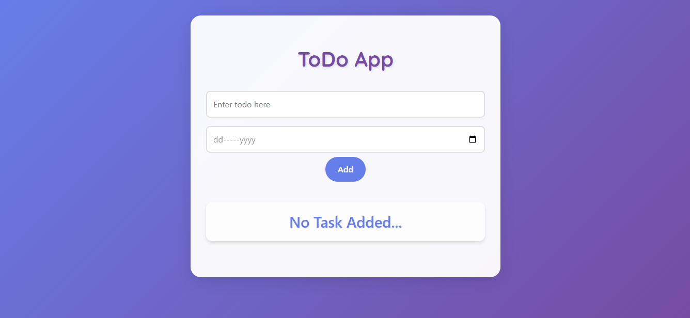

# My Todo App 📝



A modern and user-friendly Todo application built with React and Vite that helps you manage your daily tasks efficiently.

## Features 

- Add and delete tasks with due dates
- Modern, responsive UI
- Local storage persistence
- Keyboard shortcuts support
- Clean and intuitive interface
## Live Demo

Check it out [arsalanqureshitodoapp.netlify.app](arsalanqureshitodoapp.netlify.app)

## Tech Stack 

- React.js
- Vite
- CSS Modules
- Local Storage API

## Getting Started 

### Prerequisites

- Node.js (version 14 or above)
- npm or yarn

### Installation

1. Clone the repository
```bash
git clone <your-repo-url>
```

2. Navigate to project directory
```bash
cd MyToDoApp
```

3. Install dependencies
```bash
npm install
```

4. Start the development server
```bash
npm run dev
```

## Usage 

1. Add a new task:
   - Type your task in the text input
   - Select a due date
   - Click 'Add' or press Enter

2. Delete a task:
   - Click the delete button next to the task

3. View your tasks:
   - All tasks are displayed with their due dates
   - Tasks persist even after browser refresh

## Project Structure 📁

```
MyToDoApp/
├── src/
│   ├── components/
│   │   ├── AddToDo.jsx
│   │   └── ...
│   ├── store/
│   │   └── todo-items-store.jsx
│   ├── App.jsx
│   └── main.jsx
├── public/
└── package.json
```

## Features in Development 

- [ ] Task categories
- [ ] Priority levels
- [ ] Search functionality
- [ ] Dark mode support

## Contributing 🤝

1. Fork the project
2. Create your feature branch (`git checkout -b feature/AmazingFeature`)
3. Commit your changes (`git commit -m 'Add some AmazingFeature'`)
4. Push to the branch (`git push origin feature/AmazingFeature`)
5. Open a Pull Request

## Author ✨

Arsalan Qureshi

## Acknowledgments 

- React.js documentation
- Vite.js
- Modern CSS features
